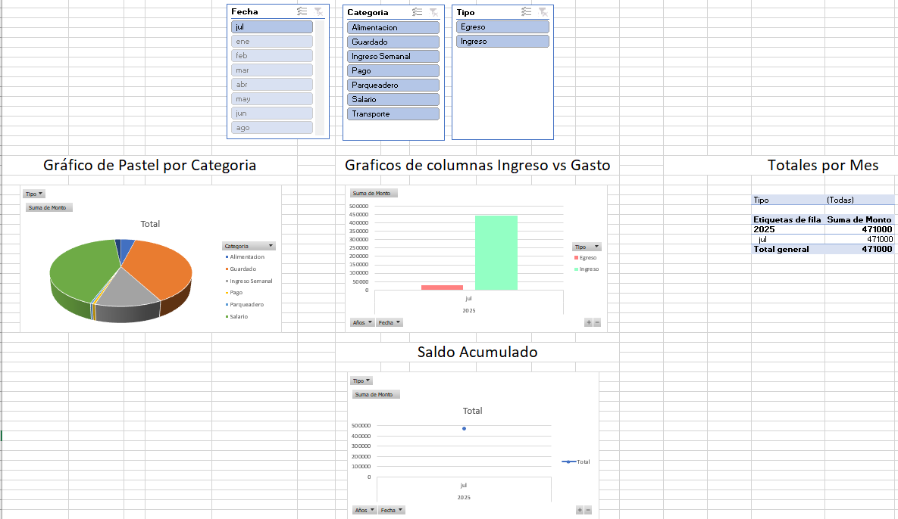

# 📊 Dashboard de Finanzas Personales

Este proyecto consiste en el desarrollo de un sistema de análisis de finanzas personales, combinando **Python** para procesamiento de datos y **Excel** para visualización interactiva. Su objetivo es ofrecer una visión clara sobre ingresos, gastos y evolución financiera a lo largo del tiempo.

---

## 🎯 Objetivos

- Analizar gastos e ingresos mensuales
- Visualizar patrones de consumo
- Mejorar el control financiero personal

---

## 🛠 Herramientas y tecnologías

- Python 3.x
- Pandas
- Matplotlib
- Seaborn
- Microsoft Excel (Tablas dinámicas, segmentadores, gráficos)
- Git & GitHub

---

## 📁 Estructura del proyecto

finanzas-dashboard/
├── data/
│ ├── finanzas.csv
│ ├── dashboard_finanzas.xlsx
│ ├── gastos_por_categoria.png
│ ├── ingresos_vs_gastos_diario.png
│ ├── saldo_acumulado.png
│ └── dashboard_excel.png
├── src/
│ ├── eda_inicial.py
│ └── visualizaciones.py
└── README.md

---

## 💸 Categorías financieras utilizadas

### Ingresos:
- Salario
- Ingreso Semanal
- Guardado
- Pago

### Gastos:
- Alimentación
- Transporte
- Educación
- Entretenimiento
- Salud
- Hogar
- Ahorro
- Deudas

---

## 📊 Análisis y visualización

- 🧾 Datos reales simulados de finanzas personales
- 📈 Exploración de datos con pandas
- 🧁 Visualizaciones creadas con matplotlib y seaborn:
  - Gráfico de pastel: distribución de gastos por categoría
  - Barras: ingresos vs gastos por día
  - Línea: saldo acumulado en el tiempo

---

## 📋 Dashboard en Excel

El archivo `dashboard_finanzas.xlsx` incluye:

- Tablas dinámicas
- Gráficos interactivos (pastel, barras)
- Segmentadores por fecha, categoría y tipo
- Diseño funcional y fácil de interpretar

---

## 🧠 Lecciones aprendidas

- Limpieza y análisis de datos financieros en Python
- Creación de visualizaciones efectivas
- Uso avanzado de Excel para dashboards dinámicos
- Documentación de proyectos en GitHub de forma profesional

---

## 🔄 Posibles mejoras futuras

- Automatizar la carga de datos desde Google Sheets o Notion
- Añadir KPIs financieros (ahorro mensual, % ingresos usados)
- Publicar versión web del dashboard con Streamlit o Dash
- Implementar alertas financieras automáticas por correo

---

## 📸 Capturas del proyecto

### Gráfico de pastel – Gastos por categoría

### Gráfico de barras – Ingresos vs Gastos

### Gráfico de línea – Saldo acumulado

### Dashboard final en Excel

---

📂 [Ver repositorio en GitHub](https://github.com/MartinMedra/finanzas-dashboard)

---

## 🙌 Gracias por leer

Este proyecto fue parte de mi formación como analista de datos.  
¡Si tienes sugerencias o mejoras, estaré feliz de recibir feedback!