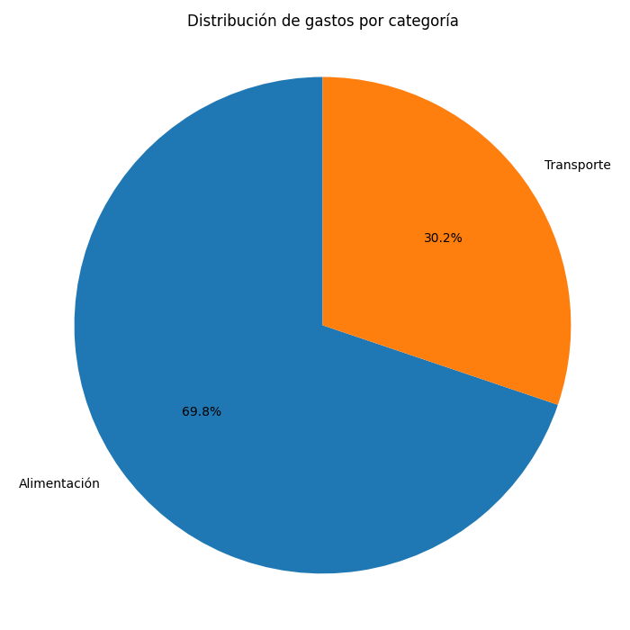
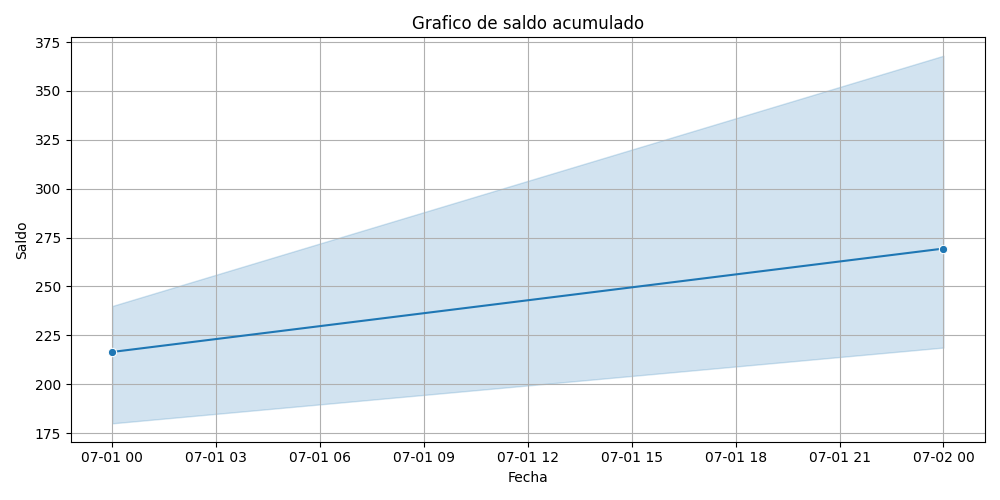

# Dashboard de Finanzas Personales

Este proyecto es un dashboard interactivo construido con Excel y Python para analizar mis finanzas personales.

## Objetivos

- Analizar gastos e ingresos mensuales
- Visualizar patrones de consumo
- Mejorar el control financiero personal

## Herramientas

- Excel
- Python
- Pandas
- Matplotlib

## Categorías Financieras

**Ingresos**:

- Salario
- Ingreso Semanal
- Guardado
- Pago

**Gastos**:

- Alimentación
- Transporte
- Educación
- Entretenimiento
- Salud
- Hogar
- Ahorro
- Deudas

## 📊 Análisis y visualización

- 🧾 Datos reales simulados de finanzas personales
- 📈 Exploración de datos con pandas
- 🧁 Visualizaciones con matplotlib y seaborn:
  - Gráfico de pastel: gastos por categoría
  - Barras: ingresos vs gastos diarios
  - Línea: saldo acumulado

## 📋 Dashboard en Excel

El archivo `dashboard_finanzas.xlsx` incluye:

- Tablas dinámicas
- Gráficos dinámicos
- Segmentadores interactivos
- Diseño limpio y funcional

## 🧠 Lecciones aprendidas

- Cómo usar Python para análisis financiero
- Visualización clara de datos
- Creación de dashboards interactivos
- Documentación de proyectos reales en GitHub

## 📸 Capturas

### Gráfico de pastel

### Gráfico de barras

### Gráfico de línea

---
